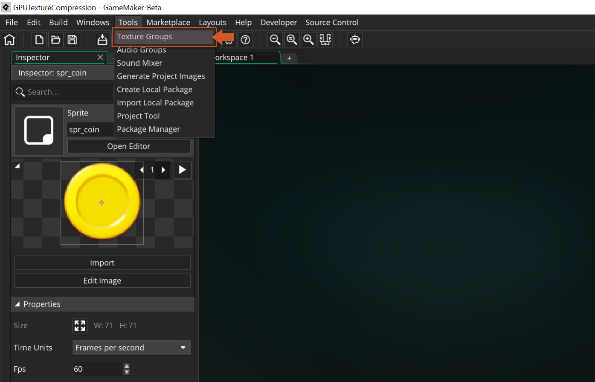

@title Configuration

# Configuration

This feature relies on third party conversion tools that the sample needs to run:

* For ASTC textures it uses `astcenc` and `astcenc-sse4.1.exe` from [ASTC-Encoder](https://github.com/ARM-software/astc-encoder) 
* For bcN textures it uses the `bc7enc` and `bc7enc.exe` from [bc7enc](https://github.com/richgel999/bc7enc)

> [!WARNING]
> Please ensure that your project complies with the licensing agreements of the encoders provided. These encoders operate under different licenses, all of which are included within the `<demo>/extensions/TextureEncode/` folder. It is essential to review and adhere to these licenses when incorporating the encoders into your project.

> [!NOTE]
> If you prefer you can swap out to use whichever encoder you prefer but you will need to modify the `ConvTextures.bat`| `ConvTextures.sh` and texture group settings in order to be able to use a different encoder. Console platforms will use encoders from within the relevant SDK directories.

## Project Setup

Texture compression options are set on a per-Texture group basis. So first you want to open your Texture Group window from the `Tools → Texture Group` dropdown menu. 

Set the texture group that you want to use to Texture Group Format `"Custom"` and add the command line parameters for the conversion that you wish to use to `"Custom Options"`. 

> [IMPORTANT] The string should start with the name of the tool that should be used to generate the textures. Below are the options for tool name, the platforms that support it and command line parameters that should be supplied alongside them.

### ASTC Compression:

* **Example Custom Options:** `"ASTC 6x6 -medium"` (produces a medium quality image using ASTC compression with a 6x6 block size)

* **Platforms:** iOS, Switch, Android

* **Parameters:** This should be passed after the name of the tool to be used.

    * **Block Size** - this is the block size used when encoding the textures. Increasing the block size will reduce the memory footprint of the textures at the cost of image quality. 

        * **Available Options:** `4x4`, `5x4`, `5x5`, `6x5`, `6x6`, `8x5`, `8x6`, `8x8`, `10x5`, `10x6`, `10x8`, `10x10`, `12x10`, `12x12`.
    
    * **Quality** - this is the target quality for the output image. Increasing the quality will improve the image quality at the expense of project compile times.

        * **Available Options:** `-fastest`, `-fast`, `-medium`, `-thorough`, `-verythorough`, `-exhaustive` or numeric values from `0.0` to `100.0`

### BCN Compression:

* **Example Custom Options:**

    * `"BCN -u4"` (produces a very high quality image using BC7 compression)

    * `"BCN -3 -u2"` (produces a medium quality image using BC3 compression)

* **Platforms:** Windows, Mac (BC3 only), Xbox, PS4, PS5

* **Parameters:** This should be passed after the name of the tool to be used.

    * **Encoding Type** (*optional*) - this is the type of block compression that will be used. If nothing is supplied then BC7 is the default output. There may be different performance benefits for using alternative types of block compression on different platforms. 
    
        * **Available Options:** `-3` (for BC3 compression)

    * **Quality (`-u`)** - this is the target quality for the output image. Increasing the quality will improve the image quality at the expense of project compile times. 

        * **Available Options:** 
            - numeric values from `0` to `4` for BC7 textures 
            - numeric values from `0` to `5` for BC3 textures.

### GNF:

* Example Custom Options: `"GNF -f Bc7Unorm -b 0.5"` (produces a medium quality image using BC7 compression)

* Platforms: PS4, PS5

* Parameters:

    * **Image Format (`-f`)** - this is the format of the image that will be output by the texture tool. There may be different performance benefits for using alternative types of block compression.
    
        * **Available Options:** `Bc3Unorm`, `Bc7Unorm`

    * **Quality (`-b`)** - this is the target quality for the output image. Increasing the quality will improve the image quality at the expense of project compile times. 
    
        * **Available Options:** numeric values from `0.0` to `1.0`